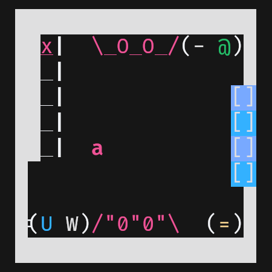
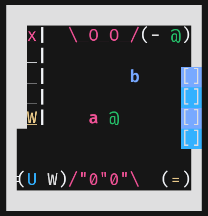
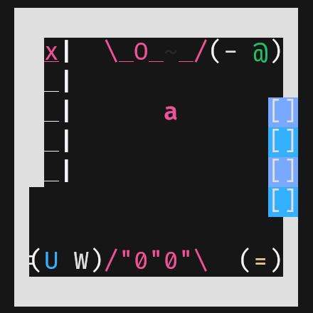
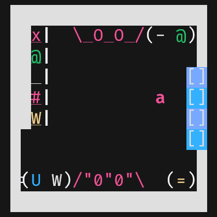
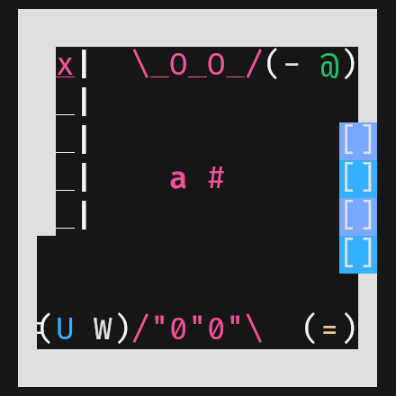
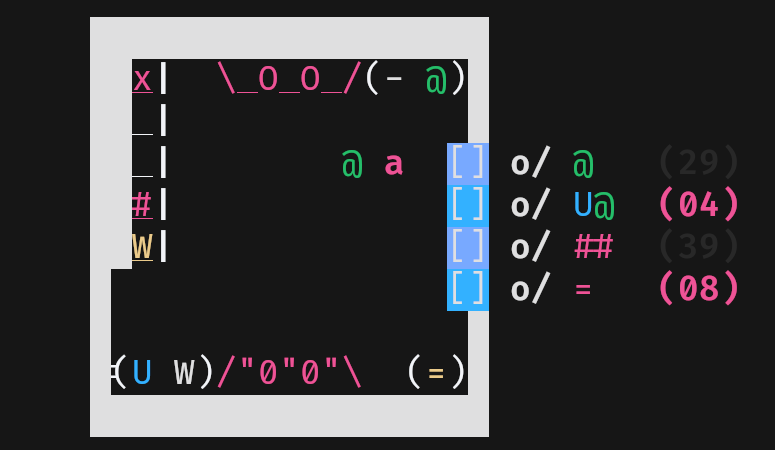
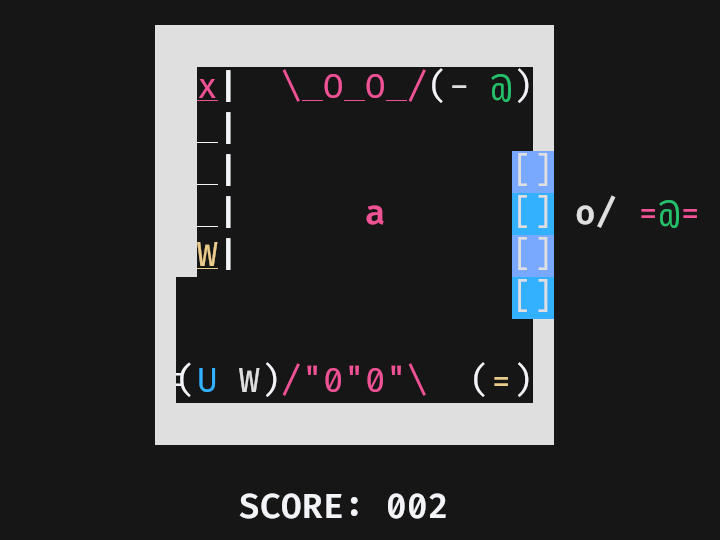

# "Overcooked" - Trabalho Final
### Sistemas Operacionais I (SSC0140)
### Professora Kalinka Regina Lucas Jaquie Castelo Branco
### Grupo
|Nome|NUSP|
|---|---|
|Gustavo Alvares Andó |15457345|
|João Victor De Bortoli Prado |13672071|
|Kaito Hayashi |12542543|
|Maria Clara de Souza Capato|15475294|

## Como Jogar
### Pré-requisitos
O jogo foi feito para ser executado no linux em um terminal com pelo menos 13 linhas e 46 colunas que suporte cor. Para verificar isso basta executar o seguinte comando:
```
tput lines cols colors
```
E vertificar que `lines`, `cols` e `colors` são iguais ou superiores a `13`, `46` e `8` respectivamente.

Além disso, é necessário que a biblioteca curses (ou ncurses) esteja instalada. É provavel que essa biblioteca já esteja instalada, mas caso não esteja basta instalar seguindo as instruções do gerenciador de pacotes da sua distribuição.

### Compilação e Execução
Para compilar o programa basta usar o comando `make all` em seu terminal.

Em seguida, deve-se executar o comando `./server.out` para criar um servidor, e em outros terminais deve se executar `./client.out` para rodar o jogo como um cliente. São suportados até 4 jogadores ao mesmo tempo, os quais podem interagir em um mesmo mapa em tempo real, compartilhando recursos.

O `client.out` aceita como primeiro parametro opcional um IP no formato `xxx.xxx.xxx.xxx` (caso nenhum IP seja passado, o cliente tentará conectar-se ao localhost `127.0.0.1`), e como segundo parâmetro opcional uma flag `-debug` contendo algumas informações de debug. Um exemplo de chamada é a seguinte:
```
./client.out 192.168.0.0 -debug
```

Para terminar a execução do servidor ou cliente basta pressionar a tecla ENTER (`\n`). Evite finalizar os programas com `Ctrl+C` visto que o não tratamento do término da execução pode causar alguns problemas na renderização dos terminais com curses. Ainda, ao finalizar a execução de um servidor, todos os clientes conectados a ele também são finalizados.

### Interações e Regras
Os jogadores no mapa são representados pelos caracteres *a*, *b*, *c* e *d*. Uma vez que entre no jogo, um jogador continua com o mesmo ícone até se desconectar, independentemente da entrada ou saída de outros jogadores. Além disso, cada item no jogo tem um caractere único para sua identificação, como no mapa abaixo.



No canto superior direito estão a salada (`@`) e o hamburguer cru (`-`). Ao lado do hamburguer temos o fogão, no qual é possível uma interação para fritá-los. Mais à esquerda temos o lixo (`X`) e as bancadas (`_|`), enquanto do lado oposto temos a bancada com pratos (`[]`) na qual os consumidores irão chegar com pedidos a serem atendidos em tempos aleatórios. Abaixo da bancada com pratos, no canto inferior direito, temos o pão do hamburguer (`=`). À esquerda está o fogão para fritar as batatas, e, por fim, as batatas cruas (`W`) e o suco (`U`).

Um jogador pode se movimentar com as teclas *W*, *A*, *S* e *D*, e pegar itens dos fogões, bancadas e espaços reservados para itens com a barra de espaço. Quando um item é pego por um jogador, ele aparece em seu rastro, como na figura abaixo. Cada jogador pode visualizar apenas o item que está segurando, para evitar que ele se confunda com o item de outros jogadores.



Para cozinhar os alimentos, temos os fogões. Quando um hamburguer ou batata é colocado em um dos fogões, um timer se inicia logo acima ou abaixo, informando o tempo restante para sua finalização. Quando este finaliza, o item pode ser coletado por um jogador e um novo timer se inicia informando o tempo até sua queima. Da mesma forma, quando esse novo timer acaba o item se torna queimado e adquire a cor preta, não podendo mais ser utilizado e tendo que ser coletado por um jogador para que se possa usar o fogão em questão novamente.



Quando um jogador precisar se livrar de um item queimado ou se arrepender de ter pego algum dos itens, pode interagir com o lixo (`X`) para que possa livrar suas mãos. De forma semelhante, ele pode guardar itens para depois em uma das bancadas (`_|`), e quando estiverem prontos, pode entregá-los aos consumidores para completar seus pedidos.



Além dos itens básicos como o suco (`U`) e as batatas (`W`), que apenas precisam ser fritas, o hamburguer precisa ser montado de acordo com as especificações do consumidor. Para juntar dois itens como a salada e o pão, basta que um jogador tenha em mãos um desses e pegue o outro de algum lugar. Essas combinações podem ser feitas diretamente no fogão, espaços reservados para itens e bancadas, de forma que o jogador fica com o item ao fim da junção. Na imagem abaixo, temos um hamburguer completo, com a carne, o pão e a salada.



Um consumidor pode requisitar mais de um item ao mesmo tempo, e só vai embora quando todos forem entregues ou seu tempo de espera acabar, conforme um timer ao lado do pedido informa. Quando um jogador entrega um desses itens do pedido, este some da lista ao lado do consumidor, de forma que os itens restantes são apenas os que ainda devem ser entregues para que ele saia satisfeito.



Por fim, temos a pontuação do jogo. Ela aparece logo abaixo do mapa, e muda conforme os pedidos são atendidos ou não. A cada pedido completo um ponto é adquirido, enquanto um pedido incompleto desconta um ponto do placar, que se inicia em 0 e não fica negativo. Para concluir pedidos basta entregar os itens requisitados corretamente.



## Semáforos e Threads
Para a implementação do jogo, foram usados semáforos para exclusão mútua (mutexes) para acesso de regiões críticas e informações compartilhadas entre mais de uma thread. Bancadas, fogões e consumidores são bons exemplos visuais de onde esses mutexes foram implementados. Todos são compartilhados pelos jogadores, de forma que quando um jogador pega um item do fogão ou da bancada, este deve desaparecer para os outros também. De forma semelhante, quando um item é entregue por um dos jogadores para um consumidor, a lista de pedidos deve ser atualizada para todos os outros também.

Ainda, existem mutexes controlando o placar, que é unificado para todos os jogadores e deve ser atualizado sempre que qualquer um deles finalizar um pedido, a lista de clientes ativos e conectados ao servidor e o controle de saída para encerramento das threads caso o programa do servidor seja finalizado. Sempre que um jogador realizar um movimento os outros devem receber uma atualização do servidor informando sua nova posição a ser renderizada no mapa. De forma parecida, quando um jogador é desconectado essa informação precisa ser passada para os outros para que ele não apareça mais na tela.

Existem trechos no código os quais precisam de acesso a duas regiões críticas ao mesmo tempo. Para lidar com essas situações corretamente, foi criada uma lógica de checagem para conseguir acesso aos dois semáforos sem causar deadlocks. Primeiro tenta-se garantir o acesso de um deles, e em seguida do outro. Caso o outro esteja em uso no momento, o semáforo já adquirido é desbloquado, e uma nova tentativa ocorre até que ambos estejam disponíveis. Ao liberar o semáforo inicialmente bloqueado evitamos a situação em que uma thread tem acesso ao semáforo X e precisa do Y, enquanto outra já tem o Y e ainda precisa do X.

Esses semáforos são de extrema importância para evitar que dois clientes acessem uma mesma região ao mesmo tempo, sobrescrevendo valores e causando inconsistências. Um caso mais simples que poderia ocorrer caso eles não fossem utilizados seria a duplicação de itens caso dois jogadores os pegassem dos fogões ou das bancadas ao mesmo tempo, ou até mesmo a entrega de dois itens iguais para satisfazer um mesmo consumidor.

Com relação às threads, foram implementadas 2 por cliente e 3 no servidor, sendo mais uma thread criada para cada cliente que pode se conectar no caso do servidor.

No cliente, elas ficaram responsáveis por renderizar a parte visual do jogo e enviar mensagens para o servidor sempre que o cliente em questão realizar uma ação, e ler mensagens recebidas do servidor contendo os updates de todos os outros jogadores e das estruturas compartilhadas por eles.

Já no servidor, existem 3 threads responsáveis por assuntos gerais e uma por cliente que pode se conectar. Para as gerais, temos uma para receber novas conexões e checar se o número máximo foi atingido, uma para lidar com a lógica do jogo com relação aos timers e chegada de clientes e uma para ler input do terminal, encerrando o programa quando ENTER for pressionado. Já para as threads de cada cliente, elas serão responsáveis por checar se o cliente em questão se desconectou e lidar com ações como input e interações deles com o mapa.

## Detalhes do Código

Devido ao tamanho do código, ele foi dividido em vários arquivos *.c* e *.h* de nomes correspondentes.

Os arquivos `client` contém todo o código referente ao funcionamento dos clientes, como abrir seu socket, realizar a conexão com o servidor e lidar com a utilização da biblioteca curses.

Os arquivos `server` são responsáveis por todo o código do servidor, lidando com novas conexões e mandando mensagens de update para todos os clientes sempre que ocorre uma modificação.

Os arquivos `message` contém todas as mensagens passadas dos clientes para o servidor e vice-versa. Neles estão pré definidos os parâmetros para cada mensagem passada, assim como seus tipos para identificação e tamanhos.

Os arquivos `map` contém todos os mapas do jogo, tanto o visual como o de localização de itens, área de movimentação e cores, por exemplo. Neles também está a lógica de inicialização das bancadas, fogões e consumidores.

Os arquivos `render` ficaram responsáveis por toda a parte de renderização do mapa e dos jogadores, atribuindo corretamente as cores e características de cada coisa.

Os arquivos `client_process_message` são responsáveis por funções de processamento de mensagem do server, as quais lidam com todos os tipos de mensagem como updates de espaços compartilhados e do placar do jogo

Os arquivos `server_send_message` contém todas as funções de broadcast que atualizam o jogo e enviam mensagens para todos os jogadores.

Os arquivos `server_game_logic` são responsáveis por funções que tratam da lógica geral do jogo, como criar consumidores, atualizar bancadas e lidar com os timers corretamente.

Os arquivos `utility` contém funções auxiliares que não se encaixavam bem em nenhum dos outros arquivos, como a lógica de combinação de itens, uma função para lock e unlock de dois mutexes ao mesmo tempo e mensagens de erro.